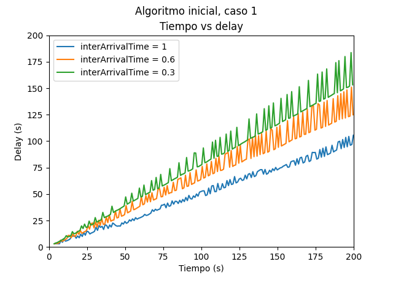
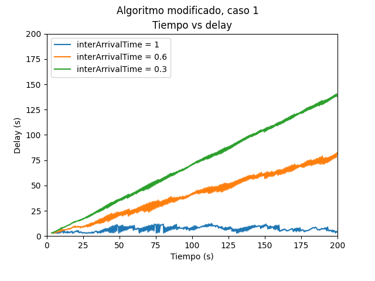

# Análisis de enrutamiento en redes de topología de anillo

# Grupo 29

## Integrantes:

- Lara Kurtz, lara.kurtz@mi.unc.edu.ar
- Lautaro Rodríguez, lautaro.rodriguez@mi.unc.edu.ar

# Abstract

Este informe analiza el comportamiento del tráfico de red en una topología de anillo utilizando diferentes algoritmos de enrutamiento. El objetivo es comparar el rendimiento de estos algoritmos en términos del `retardo` de los paquetes. Para lograrlo, se implementaron dos algoritmos: uno **inicial** proporcionado por la cátedra y otro **modificado** llamado "Hop count modificado".

# Introducción

La red sobre la que se va a trabajar es una red con una topología en forma de anillo compuesta por 8 nodos numerados del 0 al 7.

Cada nodo posee dos interfaces de comunicación full-duplex, una para establecer conexión con el nodo de la izquierda y otra para comunicarse con el nodo de la derecha.

El algoritmo proporcionado por la cátedra para el enrutamiento de paquetes solo los envía en una dirección, siguiendo el sentido de las agujas del reloj (a través de la Interfaz `0`). Esto implica que no se aprovecha la otra interfaz de comunicación disponible.

Esta limitación conlleva un `retardo` en la entrega de los paquetes:

- Si el nodo de destino se encuentra a la izquierda del nodo emisor, el paquete debe realizar una vuelta completa a la red antes de llegar a su destino.

- Dado que todos los paquetes se envían en el mismo sentido, se crea un cuello de botella en los nodos ubicados a la derecha del nodo emisor, ya que todos los paquetes deben pasar por ellos. Este problema se acentúa cuando múltiples nodos envían paquetes al mismo tiempo.

# Algoritmo de enrutamiento modificado

Se presenta un nuevo algoritmo que tiene como objetivo principal disminuir el retardo de los paquetes. Este algoritmo permite enviar los paquetes en ambos sentidos, aprovechando las dos interfaces de comunicación disponibles en cada nodo.

El nuevo algoritmo utiliza el método de contar saltos (hop count) para determinar la interfaz por la cual enviar cada paquete. Se busca seleccionar la interfaz que requiera la menor cantidad de saltos para llegar al nodo destino, con el fin de reducir el retardo en la entrega de los paquetes.

Además, este algoritmo busca mitigar el problema del cuello de botella que se genera en los nodos ubicados a la derecha del nodo emisor. Al distribuir de manera más equitativa la carga de tráfico, se logra una mejor utilización de los recursos de la red.

### Suposiciones:

- Se asume que la red de topología de anillo es simétrica.

- Se considera que la topología de la red es estática, lo que implica que no hay cambios en la conexión entre los nodos durante el funcionamiento del algoritmo.

### Algoritmo

El algoritmo de enrutamiento modificado sigue los siguientes pasos:

1. Al iniciar la simulación, cada nodo envía un paquete de reconocimiento denominado `Hello` a través de la interfaz `REC_LNK`, definida como `0`. El paquete circula en sentido horario y se incrementa un contador de saltos dentro del mismo en cada salto. El objetivo es que el paquete complete una vuelta al anillo y regrese al nodo de origen.

2. Cuando el paquete `Hello` llega al nodo destino establecido en el archivo de configuración `omnetpp.ini`, se registra el número de saltos realizados hasta ese momento en un campo especial dentro del paquete. Luego, el paquete continúa su trayectoria en la misma dirección que venía.

3. Al regresar el paquete `Hello` al nodo emisor, este utiliza la información contenida en el paquete para determinar la interfaz óptima para enviar paquetes al destino, y luego lo descarta. Se selecciona la interfaz que requiera la menor cantidad de saltos para alcanzar el nodo destino. Para tomar la decisión, se considera lo siguiente dado que la topología de anillo simétrica:

   - Si se necesitó saltar menos de la mitad (o igual a la mitad) de los nodos de la red para llegar al destino desde la interfaz `REC_LNK`, se elige esa interfaz como óptima (`REC_LNK`).
   - Si se necesitó saltar más de la mitad de los nodos, se selecciona la otra interfaz como óptima (`!REC_LNK`)

   Esta información se almacena en un booleano, ya que hay dos posibles interfaces.

# Análisis de las redes bajo los algoritmos de enrutamiento

Se utiliza una distribución exponencial con un parámetro variable, que toma los siguientes valores: `0.3`, `0.6` y `1`, lo que significa que los paquetes se generan en promedio cada `0.3`, `0.6` y `1` segundo. Se plantean dos casos de estudio:

## Caso 1: Dos nodos envían paquetes al mismo nodo destino

Los nodos **0** y **2** envían paquetes al nodo **5**.

### Comparación del delay de los paquetes en ambos algoritmos

El algoritmo modificado reduce significativamente el **delay** de los paquetes en comparación con el algoritmo inicial. Esto se debe a dos factores:

- Reducción de la distancia recorrida por los paquetes: El algoritmo modificado disminuye la cantidad de saltos que los paquetes deben realizar para llegar a su destino.

- Distribución equitativa de la carga de tráfico: El nuevo algoritmo distribuye de manera más equitativa la carga de tráfico entre las interfaces de comunicación de los nodos. Esto evita la congestión y el cuello de botella que se producían en los nodos ubicados a la derecha del nodo emisor en el algoritmo inicial.

</img>

</img>

### Comparación del tamaño del búfer de las interfaces en ambos algoritmos

Se observa que el algoritmo modificado distribuye de manera más equitativa la carga de tráfico entre las interfaces, evitando congestionar el buffer del nodo `0`.

## Caso 2: Todos los nodos envían paquetes al mismo nodo destino

Los nodos **0**, **1**, **2**, **3**, **4**, **5**, **6** y **7** envían paquetes al nodo **5**.

### Comparación del delay de los paquetes en ambos algoritmos

Se observa que el algoritmo modificado reduce de manera significativa el delay en comparación con el algoritmo inicial. Esto se debe a la forma en que se distribuye la carga de tráfico en el sistema. En el algoritmo modificado, la carga se divide en dos: la mitad de los nodos envían paquetes a través de la interfaz `0` y la otra mitad utiliza la interfaz `1`.

### Comparación del tamaño del búfer de las interfaces en ambos algoritmos

# Conclusiones

En el caso de estudio 1, donde solo dos nodos envían paquetes al mismo destino, el algoritmo modificado logra reducir tanto el retardo como la cantidad promedio de saltos necesarios para entregar los paquetes. Esto se debe a la distribución equitativa de la carga de tráfico entre las interfaces de comunicación de los nodos.

En el caso de estudio 2, donde todos los nodos envían paquetes al mismo destino, el algoritmo modificado también logra disminuir el retardo promedio de los paquetes en comparación con el algoritmo inicial. Aunque la cantidad promedio de saltos no disminuye significativamente.

Sin embargo, es importante destacar que el algoritmo modificado aún puede ser mejorado. En lugar de hardcodear la ruta de los paquetes en la etapa de inundación, se podría implementar un análisis periódico del estado de la red para enrutar los paquetes en función de los cambios en la topología. Esto permitiría adaptar el enrutamiento de manera dinámica y optimizar aún más el rendimiento de la red.

### Caso de estudio 1: Average Hop Count

| interArrivalTime | Algoritmo inicial | Algoritmo modificado |
| ---------------- | ----------------- | -------------------- |
| 0,3              | 3.44              | 3                    |
| 0,6              | 3.73              | 3                    |
| 1,0              | 3.91              | 3                    |

### Caso de estudio 2: Average Hop Count

| interArrivalTime | Algoritmo inicial | Algoritmo modificado |
| ---------------- | ----------------- | -------------------- |
| 0,3              | 1.33              | 1.31                 |
| 0,6              | 1.65              | 1.57                 |
| 1,0              | 2.06              | 1.84                 |

### Caso de estudio 1: Average Delay

| interArrivalTime | Algoritmo inicial | Algoritmo modificado |
| ---------------- | ----------------- | -------------------- |
| 0,3              | 82                | 71.08                |
| 0,6              | 69.19             | 41.07                |
| 1,0              | 51.15             | 6.90                 |

### Caso de estudio 2: Average Delay

| interArrivalTime | Algoritmo inicial | Algoritmo modificado |
| ---------------- | ----------------- | -------------------- |
| 0,3              | 79.31             | 80.25                |
| 0,6              | 70.83             | 71.51                |
| 1,0              | 64.53             | 63.66                |
